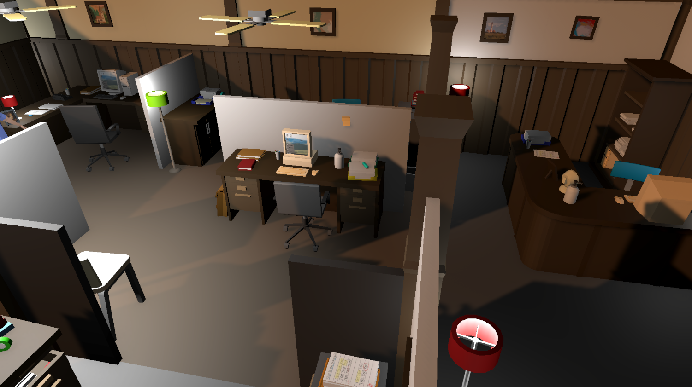

# BSM-SİM: Information Systems Engineering Serious Game 🎓💻

BSM-SİM is a Unity-based "Serious Game" designed to allow Information Systems Engineering students to put their theoretical knowledge into practice through realistic corporate crisis scenarios. 

Game is being developed under the Senior Graduation Project, transforming the Information Systems Engineering curriculum into an experiential learning model through corporate scenarios. The project aims to deliver a demo (MVP) for the graduation thesis, while the TÜBİTAK phase focuses on measuring and reporting the final product's impact on students.

Developed with a strong focus on software engineering principles, the project features a flexible, modular, and scalable system architecture.

> ⚠️ **Repository Status Notice:** > This repository is currently serving as a **showcase** for the Minimum Viable Product (MVP) stage. It contains architectural designs, core C# code snippets, and conceptual documents. Once the prototype playtesting is complete, a full-scale development environment—complete with standard commit histories, branching strategies, and CI/CD pipelines—will be established.

## 🎨 Asset Credits & UI Disclaimer

* **UI Placeholders:** Certain graphical user interface (GUI) elements visible in the prototype screenshots (such as specific OS wallpapers, IDE, and email client icons) are temporary placeholder assets. They were used strictly for rapid prototyping and familiarity during early testing. A comprehensive visual overhaul is planned, and these will be entirely replaced with original or open-source alternatives in the final deployment.
* **3D Environment:** The corporate office environment and hardware props are constructed using the "[Low Poly Office Set 1](https://assetstore.unity.com/packages/3d/props/low-poly-office-set-1-140-models-vnb-327126)" created by **VNB**.

## 🚀 Key Features & Architecture

* **Data-Driven Design:** Corporate scenarios and tasks are isolated using Unity's `ScriptableObject` (TaskSO) architecture rather than being hardcoded. This plug-and-play approach allows for the easy integration of new curriculum topics.
* **Layered Architecture & Event-Driven Communication:** Logical and visual components are strictly separated to ensure *Separation of Concerns*,*Loose Coupling* and *OOP standarts* across the system.
* **Design Patterns:** The system lifecycle and global state management are optimized using Singleton and Observer patterns.
* **Virtual Operating System (BSM-OS):** Features a fully functional in-game desktop, an email client, and an Integrated Development Environment (IDE) to simulate a real workspace.

## 📂 Repository Structure

* `/Scripts`: Core architecture, UI managers, and interaction components written in C#.
* `/Docs`: Game Design Document (GDD), layered architecture UML diagrams, and academic reports.
* `/Screenshots`: Visual captures from the current MVP stage.

## 📸 Prototype Showcase

*(Note: Certain UI elements shown below are temporary placeholders used for rapid prototyping. See the Asset Credits section for details.)*

*General view of the corporate office environment designed with a low-poly aesthetic.*

 

*The Software Development Department where players interact with their main workstations.*

 

*The virtual operating system (BSM-OS) featuring the in-game Integrated Development Environment (IDE) for coding tasks.*

 

*The in-game email client used for receiving daily corporate directives, tasks, and scenario updates.*

 

*The overlay tab menu designed for tracking current objectives, daily credits, and performance metrics.*

 

*Interactive dialogue screen for communicating with NPC colleagues and navigating organizational decisions.*

## 🎨 Asset Credits & UI Disclaimer

* **UI Placeholders:** Certain graphical user interface (GUI) elements visible in the prototype screenshots (such as specific OS wallpapers, IDE, and email client icons) are temporary placeholder assets. They were used strictly for rapid prototyping and familiarity during early testing. A comprehensive visual overhaul is planned, and these will be entirely replaced with original or open-source alternatives in the final deployment.
* **3D Environment:** The corporate office environment and hardware props are constructed using the "[Low Poly Office Set 1](https://assetstore.unity.com/packages/3d/props/low-poly-office-set-1-140-models-vnb-327126)" created by **VNB**.

## 🛠️ Development Roadmap

*A comprehensive short- and long-term development roadmap report, including a detailed technical debt analysis and future refactoring milestones, will be prepared and published here soon.*
